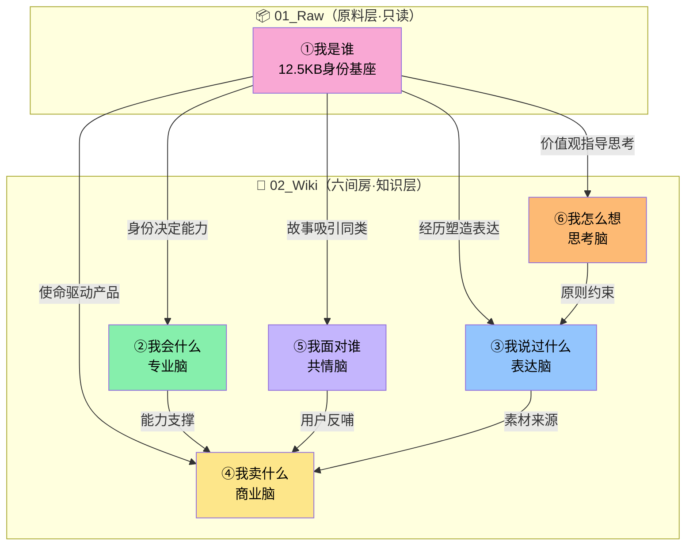

# 📖 飞书六间房 · Wiki 索引

> **来源**：[飞书知识库](https://my.feishu.cn/wiki/LyoWwTlQNiIus9kdcXMchcnVnwg)
> **同步时间**：2026-04-26
> **数据流向**：`[[01_Raw/2026-04-26_原始素材_个人故事-我是谁]]` → **以下所有 Wiki 条目**

---

## 🗺️ 六间房全景图

```
┌─────────────────────────────────────────────────────┐
│                  蓉蓉子的六间房                       │
│                                                     │
│   ① 我是谁 ──→ 身份基座（原始素材·只读）           │
│      ↓                                              │
│   ② 我会什么 ──→ 专业脑（能力树·方法论）            │
│   ③ 我说过什么 ──→ 表达脑（金句·选题·风格）        │
│   ④ 我卖什么 ──→ 商业脑（产品矩阵·定价）           │
│   ⑤ 我面对谁 ──→ 共情脑（用户画像·痛点）           │
│   ⑥ 我怎么想 ────→ 思考脑（判断框架·价值观）       │
│                                                     │
└─────────────────────────────────────────────────────┘
```

---

## 📂 02_Wiki / 六间房文件索引

| 房间 | 文件 | 大小 | 核心内容 |
|---|---|---|---|
| [[1号房-我是谁]] | `身份基座_我是谁.md` | 12.5KB | 版本人生1.0→3.0、VMV、IP人设卡、核心主张 |
| [[2号房-我会什么]] | `知识库_能力盘点-我会什么.md` | 7.9KB | 能力树、3大原创方法论、8个知识点 |
| [[3号房-我说过什么]] | `金句库_观点语录-我说过什么.md` | 8.3KB | 18条金句、短内容模板、选题池(3主线)、4种写作结构 |
| [[4号房-我卖什么]] | `产品体系_服务定价-我卖什么.md` | 7.5KB | 产品矩阵(4层级)、MVP记录、商业闭环、服务SOP |
| [[5号房-我面对谁]] | `客户画像_目标受众-我面对谁.md` | 7.7KB | 用户画像卡片、痛点矩阵(5类)、案例模板、趋势分析 |
| [[6号房-我怎么想]] | `方法论_思考框架-我怎么想.md` | 8.8KB | 判断模型(4维度)、思考框架(5种)、风格模型(4种)、输出原则 |

---

## 🔗 房间关系图



---

## 📝 待补充

### 待填充目录（已有文件夹，等内容）

| 目录         | 用途            | 触发条件        |
| ---------- | ------------- | ----------- |
| `学员档案交行中/` | 在服学员信息卡片      | 新学员签约时      |
| `学员档案已到期/` | 已结束的学员        | 合同到期时       |
| `案例库/`     | Output好内容反向沉淀 | 每次Output产出后 |

### 待补充内容

- [ ] 咨询逐字稿 → `01_Raw/咨询逐字稿/`
- [ ] 学员档案卡片（梦婷/安宁/温帅/華总/颖心）
- [ ] 公众号已发布文章 → `04_Output/自媒体内容/公众号/已发布/`
- [ ] 二号房「真实案例库」填充
- [ ] 四号房具体价格表补充
- [ ] 三号房从公众号文章批量提取更多经典句子

---

*本文件由 石榴🐾 维护 · 基于 Karpathy 六间房架构*
*最后更新：2026-04-26*
